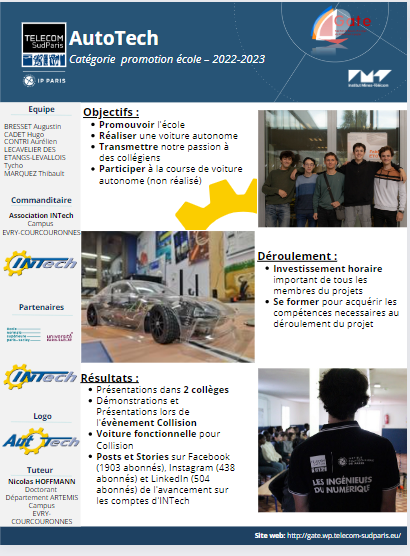

# Autotech
Projet effectué, de Octobre 2023 à Avril 2024, dans le cadre scolaire du Gate Autotec, afin de participer à la course de voiture autonome de l'ENS paris Saclay.   
Séparation du travail en Trois équipes : Equipe IA, équipe bas niveau ainsi qu'une équipe ROS

<code></code>

